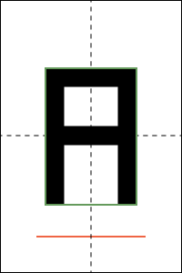
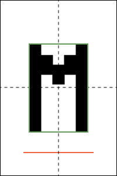

# Tarea nro. 4
## FI3104B - Métodos Numéricos para la Ciencia y la Ingeniería
#### Prof. Valentino González

Integre la ecuación de Poisson en 2D para el potencial electrostático:

> Latex: `\nabla^2 V(x, y) = -\rho(x, y)`

Integre dentro de una caja rectangular de dimensiones 10 [cm] x 15 [cm]
conectada a tierra (es decir, V = 0 en el perímetro). Definiremos el centro de
la caja como (x, y) = (0, 0). Dentro de la caja hay una linea y = -5.5; x=[-3:
3] que cumple con condiciones de borde derivativas:

> Latex: `dfrac{dV}{dn} = \pm 1`

tomando el signo + cuando la derivada perpendicular a la linea es calculada en
y > -5.5 y el signo negativo cuando la derivada se toma para y < -5.5.

Además, en la caja hay una letra, la primera letra de su nombre. Dicha letra
está contenida dentro del rectángulo centrado con lados 5 [cm] x 7 [cm]. Dibuje
la letra como quiera, pero intente hacerla lo más simple posible y en particular
evite lineas curvas y diagonales. El grosor de las líneas que dibujan su letra
debe ser de 1 [cm]. La carga total dentro de la letra es:

> Latex: `Q = \int \rho(x, y) dx dy = 1 [C]`

(la unidad es el Coulomb) y la densidad de carga es constante dentro de la
letra. A continuación un par de ejemplos de letras complicadas (sólo como
referencia, Ud. puede dibujarlas como mejor le parezca). La línea roja es donde
se aplica la condición de borde derivativa. El rectangulo verde es el que
contiene a la letra. Las lineas punteadas marcan el centro de la caja.

Letra A (y también R), y letra M:

 

> __NOTAS__
>
>    - Para integrar use un reticulado con h~0.2[cm]. 
>    - Use el método de sobre-relajación sucesiva con distintos w y estudie
>      cuantas iteraciones hacen falta para converger en cada caso.
>    - Tenga cuidado al implementar el método de sobre-relajación sucesiva,
>      recuerde la modificación indicada en clase. 
>    - Note que tendrá que derivar el algoritmo de iteración para los puntos
>      adyacentes al segmento con condición de borde derivativa y para el
>      segmento mismo.
>    - Debido al punto anterior, es recomendable separar la iteración en
>      distintos segmentos
>    - Debe definir un criterio de convergencia, explicítelo en el informe.
>    - Como hicimos en clase, parta con un setup simple y vaya agregando
>      complejidad, asegurándose primero de que los casos simples funcionan.
>      Vaya dejando el rastro de su trabajo en git.

 
__Otras Notas.__

- Utilice `git` durante el desarrollo de la tarea para mantener un historial de
  los cambios realizados. La siguiente [*cheat
  sheet*](https://education.github.com/git-cheat-sheet-education.pdf) le puede
  ser útil. Evaluar el uso efectivo de `git`. Recuerde hacer cambios
  significativos pero relativamente pequeños y guardar seguido.  Evite hacer
  `commits` de código que no compila y deje mensajes que permitan entender los
  cambios realizados.

- También evaluaremos su uso correcto de python. Si define una función
  relativamente larga o con muchos parámetros, recuerde escribir el *doctsring*
  que describa los parametros y que es lo que hace la función.  También
  recuerde usar nombres explicativos para las variables y las funciones.  El
  mejor nombre es aquel que permite entender que hace la función sin tener que
  leer su implementación.

- A partir de esta tarea, los códigos entregados deben pasar las reglas de
  [PEP8](https://www.python.org/dev/peps/pep-0008/). En la línea de comando
  puede intentar `pep8 <script.py>` y asegurarse de que no hay errores ni
  advertencias. Los comandos `pep8 --show-source <script.py>` y `pep8
  --show-pep8 <script.py>` que vimos en clase le pueden ser útiles. Si es de
  aquellos que resuelven su tarea usando el `ipython notebook`, entonces exporte
  la tarea a un archivo normal de `python` y asegúrese de que pasa el test de
  PEP8.

- La tarea se entrega como un *pull request* en github. El *pull request* debe
  incluir todos los códigos usados además de su informe.

- El informe debe ser entregado en formato *pdf*, este debe ser claro sin
  información ni de más ni de menos.
